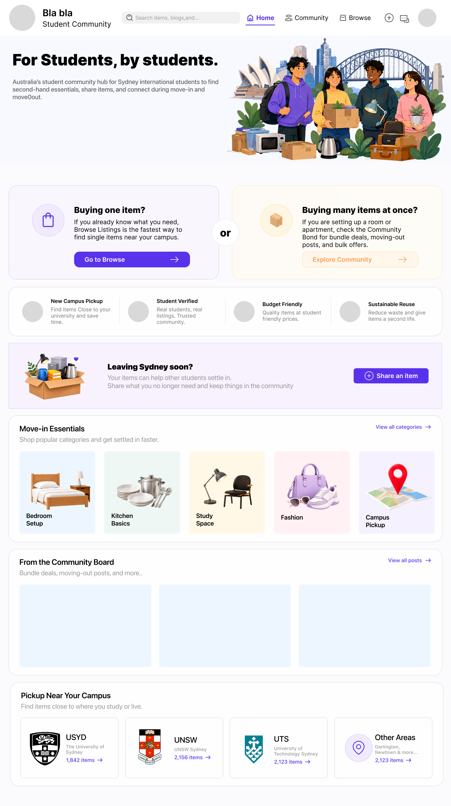
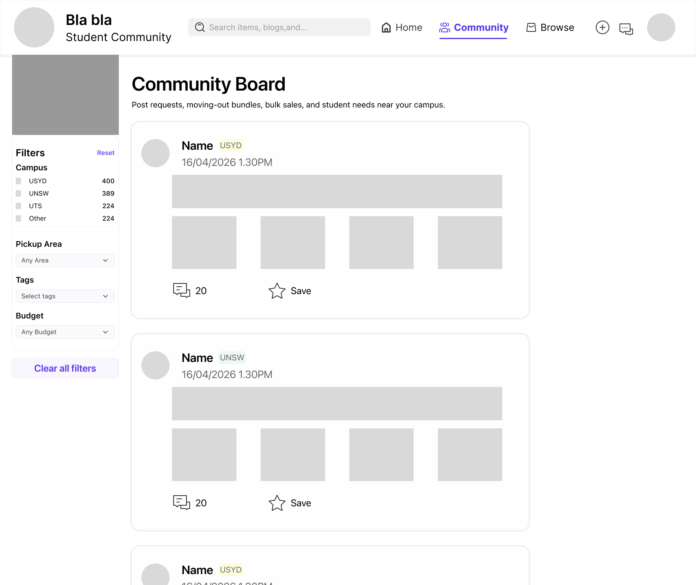
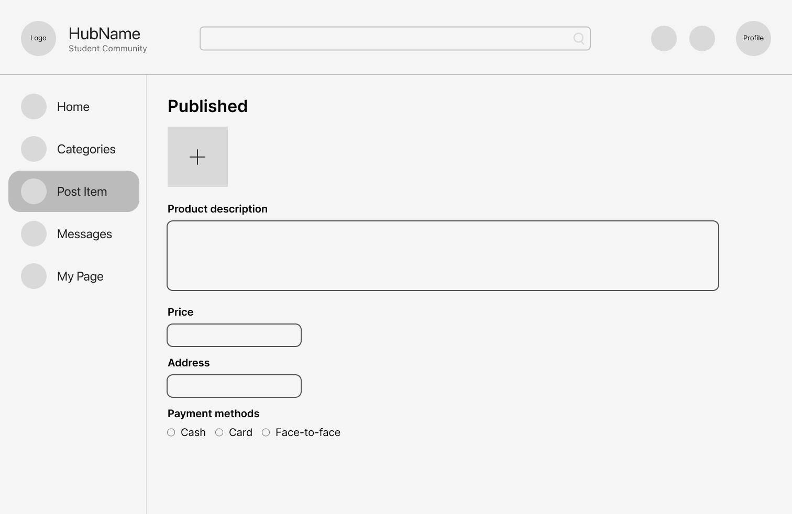
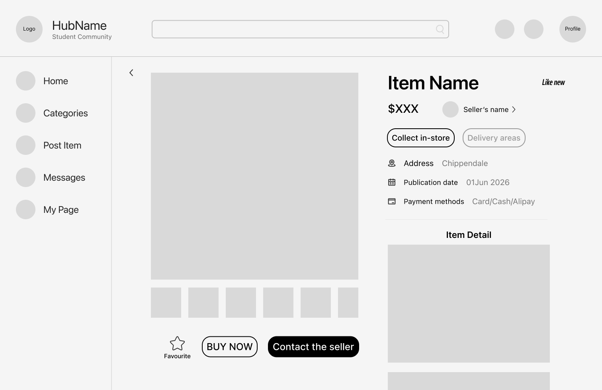

# Using Wireframes to Structure Community-Based User Flows

Having established that the project is a resource-sharing community hub for international students in Sydney, we need to consider further how users will complete tasks on the platform. At this stage, the role of wireframes is not merely to organise the page layout, but to help us determine what functions each page should fulfil and how users should navigate to the appropriate paths.

Firstly, for users with specific purchasing needs, the most effective path is to go to ‘Browse Listings’, find a specific item via search, categories and filters, and then visit the product details page to decide whether to contact the seller. This path is relatively straightforward and can be summarised as: Home → Browse → Listing Detail → Messages.

However, for users needing to buy or sell a wide variety of items—and wishing to do so in a single transaction—relying solely on ‘Browse Listings’ is not ideal. Therefore, we have introduced a ‘Community Board’. This is not merely a product browsing page, but a community space where students can post requests, sell items in bulk, offer items for free, or advertise clear-out sales due to moving house. It supports post types such as ‘Looking to buy multiple items’, ‘Moving out sale’, ‘Free/Giveaway’ or ‘Bulk sale’. This aligns more closely with the way students actually interact within the international student community than standard product listings do.

This realisation has also altered the functional positioning of the homepage. The homepage should not merely be a landing page for displaying products, but rather a hub for directing users to different tasks. Consequently, in the homepage wireframe, I designed two main entry points: if a user simply wishes to search for individual items, they can go to ‘Browse Listings’; if a user wants to buy multiple items at once, or view moving-out clearance and bulk sale posts, they can go to the ‘Community Board’. This helps users choose the correct path based on their needs.

Whilst refining the wireframe, we also iterated on the overall navigation. The initial design leaned more towards sidebar navigation, a structure suited to dashboard-style interfaces. However, whilst further designing the Community Hub homepage, I realised it was not entirely suitable for the current web experience. The homepage needs to function as a single-page entry point, incorporating areas such as the hero section, task routing, community content previews, Move-in Essentials and on-campus collection. If we continued to use a sidebar, the horizontal space on the page would be compressed, and the interface would easily resemble a backend management system.

Consequently, we switched to a top navigation bar. Top navigation is better suited to the long-page structure of the web interface and ensures that core entry points such as Home, Community, Browse, Share an Item, Messages and Profile remain clearly visible. This change is not merely a visual adjustment but relates to the user flow; upon entering the homepage, users should first understand the platform’s positioning before selecting Browse or Community based on their specific task.

This process of designing and refining the wireframes has made me realise that user flow design is not simply a matter of linking pages together, but requires an understanding of the differences between various user tasks. For our project, browsing individual items and posting in bulk within the community are two distinct yet complementary pathways. This distinction ensures the platform is not merely a standard marketplace, but rather a community hub built around the lifestyle needs of international students.

*Figure 1: Homepage wireframe showing how users are guided towards Browse Listings or the Community Board depending on their needs.*

*Figure 2: Community hub wireframe showing how students can explore requests, bundles, moving-out posts and shared resources.*

*Figure 3: Create item wireframe showing how students can share second-hand items with the community.*

*Figure 4: Item detail wireframe showing how users evaluate a specific item before contacting the seller.*