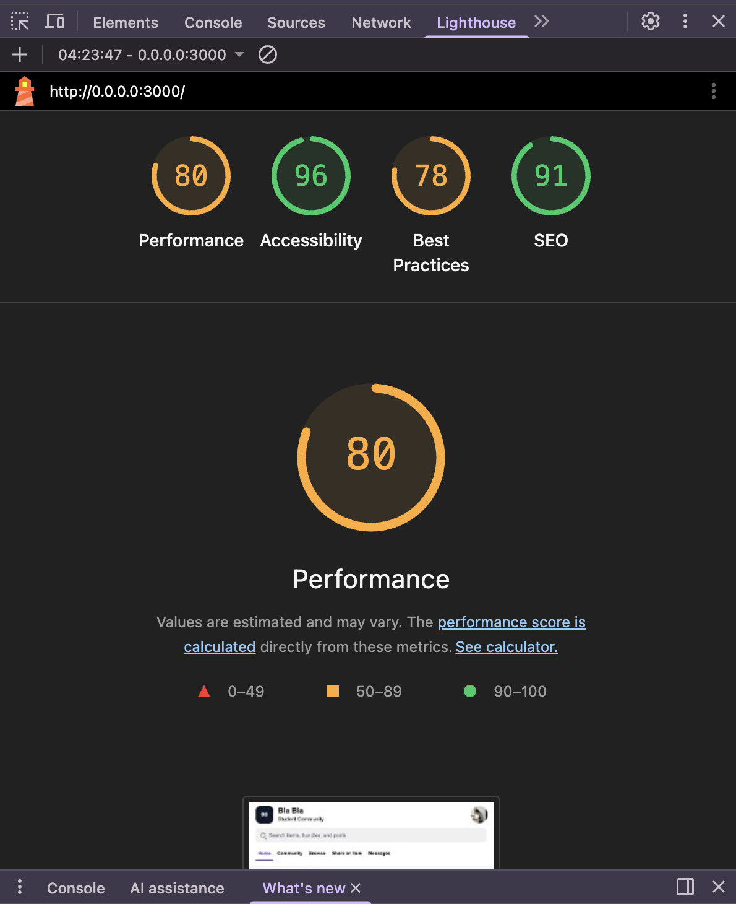
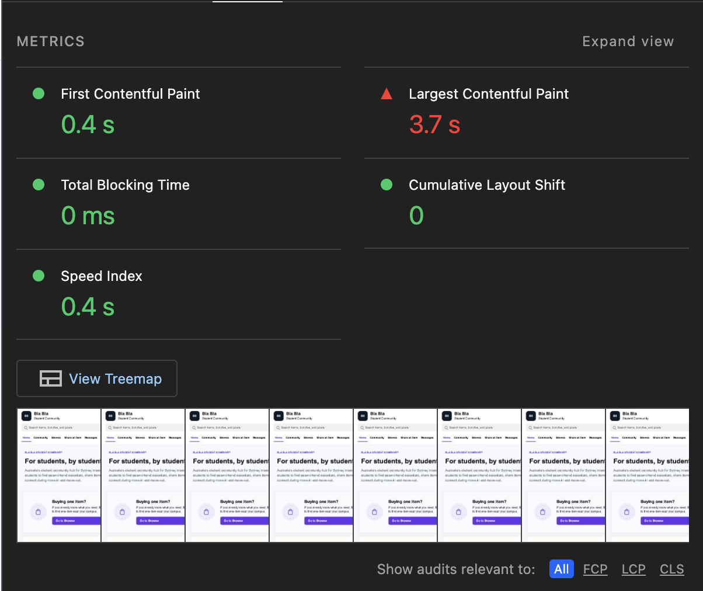
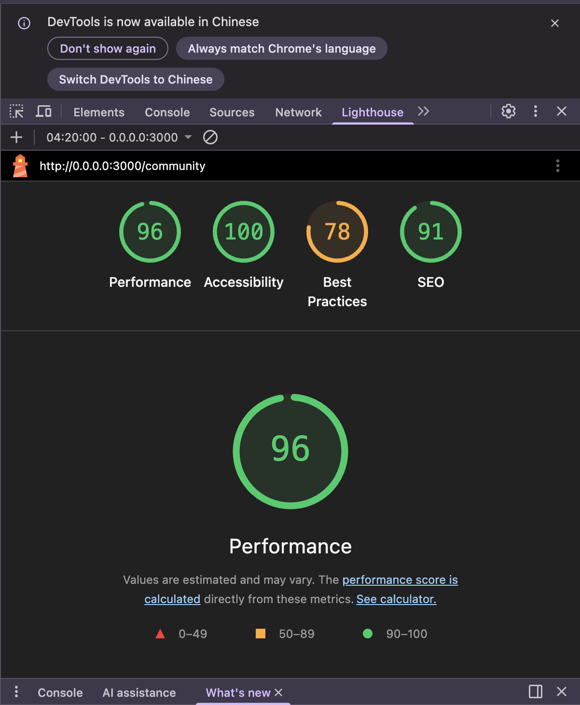
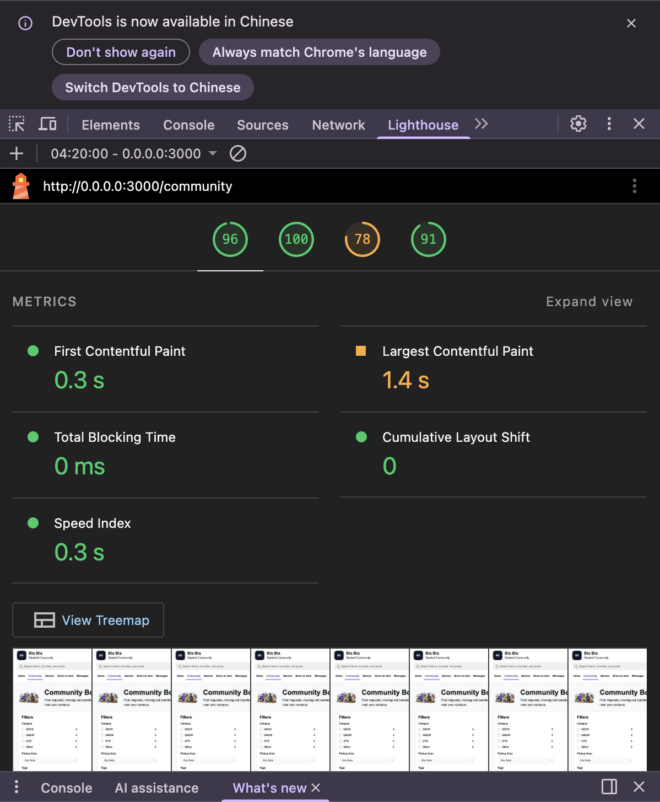
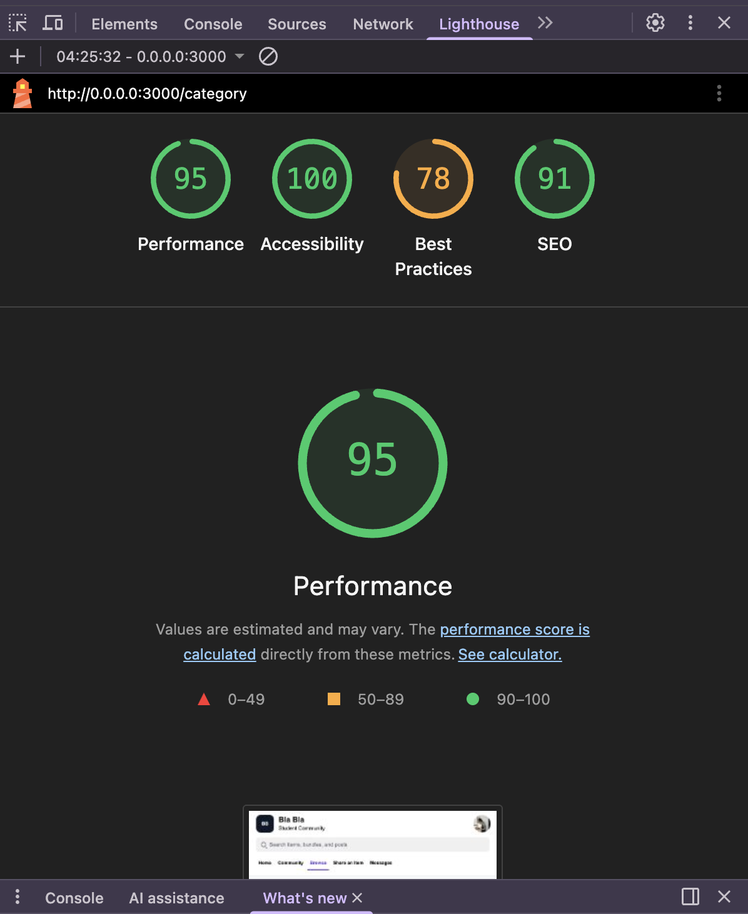
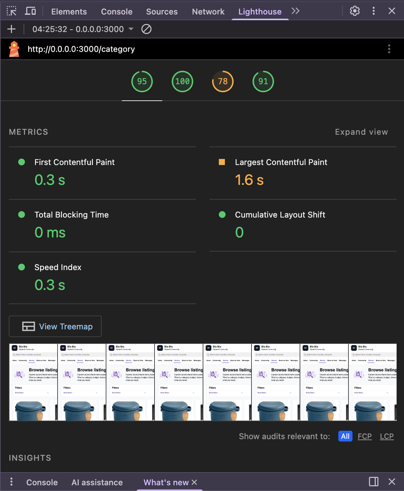

# Final Reflection on BlaBla

## Introduction
This reflection evaluates our A2 web application prototype, ‘BlaBla’. BlaBla is a second-hand marketplace and community platform designed specifically for students who are not from Sydney, with the aim of helping them buy and sell furniture, kitchenware, electronics and other household items more conveniently when moving house, starting university or leaving Sydney.

Whilst the A1 blog focuses more on planning the overall direction, design concepts and development objectives, this reflection will instead review the final prototype and evaluate its actual performance. I will assess BlaBla in terms of technical performance, user experience, accessibility, functional requirements and future technical improvements. Overall, I believe BlaBla has successfully demonstrated the core workflow of a student-centred community platform: users can log in, browse product listings, filter and view product details, save items to their favourites, communicate with sellers online, and publish content. However, the evaluation has also identified several areas for optimisation, such as image resource management and performance issues, LCP optimisation, structured product listing data, and the depth of the user experience regarding messaging and search.

## Evaluation Methods

| Evaluation area | Method used | Evidence collected |
|---|---|---|
| Performance | Lighthouse audit and manual walkthrough | Home, Community and Category page Lighthouse scores |
| Technical behaviour | Tested browsing, filtering, favourites, comments and messages | Functional testing notes |
| User experience | Peer task walkthrough | Observations from browsing, favourite, contact seller and posting tasks |
| Accessibility | Checked keyboard navigation, labels, alt text and contrast | Lighthouse accessibility scores and manual checks |
| Functional requirements | Compared original plan with final prototype | Requirement review table |

## Performance and Technical Behaviour
The Lighthouse test results indicate that BlaBla performs well on most of the pages tested, but its performance across the entire prototype is inconsistent. The community page and category page scored 96 and 95 respectively for performance, and both pages achieved a score of 100 for accessibility. These results suggest that, in the test environment, these two sections are relatively fast and stable.

However, the performance of the home page was the main weak point in this test. It received a performance score of 80, with an LCP of 3.7 seconds, falling within the ‘Needs Improvement’ range. This indicates that the loading speed of the largest visible content on the home page is below the ideal level and significantly slower than that of other pages. As the homepage is responsible for introducing the platform and guiding users to the ‘Browse’ and ‘Community’ pages, a slow initial load time may affect users’ perception of the application’s responsiveness. A likely cause is the use of large visual content on the homepage; therefore, subsequent optimisation efforts should prioritise image size, format and compression, and employ lazy loading where appropriate.

Another technical issue relates to image resource management. During testing, some images only appeared after Git LFS had been installed and correctly fetched. For an item-sharing platform, missing images is no trivial matter, as users rely on them to assess an item’s condition and practicality. This made me realise that deployment reliability is an integral part of technical performance, rather than a separate consideration. Across the three pages tested, the best practice score remained at 78 points for all of them, indicating recurring technical issues in the prototype that require further review before the application can be considered ready for production.

### Lighthouse Results
| Page Tested | Performance | Accessibility | Best Practices | SEO | Key observation |
|---|---|---|---|---|---|
| Home Page | 80 | 96 | 78 | 91 | LCP was 3.7s, suggesting slower loading of the largest home page content |
| Community Page | 96 | 100 | 78 | 91 | Strong loading performance and accessibility; LCP was 1.4s |
| Category Page | 95 | 100 | 78 | 91 | Browse page performed well with stable layout; LCP was 1.6s |

## User Experience and Accessibility
From a user experience perspective, the final prototype of Bla Bla largely supports the platform scenario for international student resource sharing established in A1. Users can navigate from the homepage to browse relevant resources, community posts or publish content, which makes the platform feel more like a student resource-sharing hub rather than a list of products. During user testing tasks, I observed that users found the ‘browse’ process relatively straightforward. Users could first browse shared items, then view prices and item details via listing cards, and finally proceed to the details page to save items or contact sellers. This indicates that the core resource discovery flow is quite clear. The test results for the community board also largely aligned with the initial objectives. Users can browse posts, view comments, or find suitable resources by posting themselves. This ensures the platform retains its community-driven, mutual-aid character, rather than centring solely on the exchange of goods.

| Task Tested | Result | Observation |
|---|---|---|
| Browse for a shared item | Completed | The design of the category pages and product detail pages is simple and clear, making them easy to understand|
| Save/ Favourite an item | Completed | The operation was successful, but the saved status could be made a bit more prominent |
| Contact another student | Completed | The path from the product details page to the messages page is very clear |
| Create a community post or listing | Partially completed | This page requires clearer guidance, as it supports two types of publication |
| Use the community board | Completed | Posts and comments support the community sharing process |

In terms of accessibility, the Lighthouse results were largely positive. The homepage scored 96 points, whilst the Community Board and Category Page both scored 100 points. This indicates that the page’s underlying structure, labelling and accessibility performed well in testing. However, this does not mean that all accessibility issues have been fully resolved. Whilst Lighthouse can identify common problems, it cannot fully verify whether the interface can be used easily with just a keyboard or a screen reader.

If this project continues, I will attempt to test the main workflows in a mouse-free environment. I will also improve custom controls, such as filters, so that users can clearly understand their selections. This will make the platform more inclusive for users with different accessibility needs.

## Functional Requirements Retrospective
Looking back at the functional requirements outlined in A1, I believe the final prototype has largely retained the original core concept: Bla Bla is a community platform designed for international students to share resources. In A1, I divided the functional requirements into two main areas: helping students find specific second-hand items they are looking for, and facilitating communication via the community for students with significant buying or selling needs. In the final prototype, every interface and related feature addresses these two areas to varying degrees.

The resource discovery process is particularly well-developed. Within this process, users can access the ‘Browse’ page from the home page or the top navigation bar. Using product cards and filters, they can view items and contact sellers, enabling them to quickly find the items they are looking for. This also supports the ‘single-item browsing’ requirement mentioned in A1. At the same time, the community interface helps the project maintain consistency with the concept of a community platform; users can not only browse product listings but also view posts, post comments and save posts.

However, some of these requirements have only been implemented at the prototype stage. Product listings still require more comprehensive structured metadata, such as collection preferences, item condition, category and stock status. Without this information, it will be difficult to ensure the reliability of future search and filtering functions. Although the messaging feature allows users to contact sellers, it does not include message status or notification functions.

This has made me realise that some of the requirements for A1 are defined too broadly. For example, ‘posting an item’ should not simply refer to submitting a form, but should also include data validation, image processing, prompts for mandatory fields, and a feedback mechanism. Going forward, I will define the completion criteria more clearly and distinguish between essential and optional features at an early stage.

### Evidence: Functional Requirements Review
| Functional requirement | Final status | Reflection |
|---|---|---|
| Homepage guidance | Completed | The homepage gives users clear entry points to browse resources, use the community board, or share an item |
| Browse shared items | Completed | Users can browse item cards, view prices and conditions, and move into item detail pages. This supports the single-item browsing requirement from A1 |
| Category and filtering | Mostly completed | Filtering supports resource discovery, but future versions need stronger structured data to make search and filtering more reliable |
| Community board | Completed | Users can view posts, comments and shared needs, which keeps the platform aligned with the community hub concept |
| Share an item / Post content | Partially completed | The feature works, but the flow needs clearer guidance because users may be choosing between a community post and an item listing |
| Contact other students | Prototype completed | Messaging allows users to contact sellers or other students, but it is not real-time and does not include message status or notifications |
| Favourite / Saved content | Completed | Users can save items or posts, supporting return visits and later decision-making |
| Payment / Order system | Not included by design | This was intentionally not prioritised because the project focused on student resource sharing rather than becoming a full e-commerce system |

## Critical Reflection and Improvement Plan
The most important lesson I have learnt from this term’s project is that a working prototype is not the same as a fully evaluated web application. During development, it is easy to focus solely on whether pages load successfully or buttons function correctly. However, the final evaluation results show that quality also depends on performance, accessibility, resource management, and whether users can complete tasks without confusion.

If this project were to continue, I would prioritise optimising existing processes and addressing existing issues rather than adding new features. Firstly, I would optimise image loading and the homepage loading speed, as the Lighthouse results indicate that LCP is the most significant performance bottleneck. Secondly, I would clarify the navigation path on the ‘Share an Item’ page; whilst it currently meets the platform’s dual objectives, some users may be unsure which type of content to share, so this section needs to be made clearer and more intuitive. Finally, I will conduct more manual accessibility testing, particularly keyboard-only testing, as Lighthouse scores alone cannot guarantee that custom controls are accessible to all users.

## Conclusion
BlaBla is a successful prototype, but it is not yet a fully-fledged system. It demonstrates that a student resource-sharing community hub has real value, particularly when browsing, community discussion and messaging are integrated. However, this evaluation has also highlighted issues regarding image performance, search accuracy, accessibility and scalability that still need to be addressed. Should I continue to optimise and develop the BlaBla community website, I would prioritise making the existing core processes clearer, more accessible and more scalable.